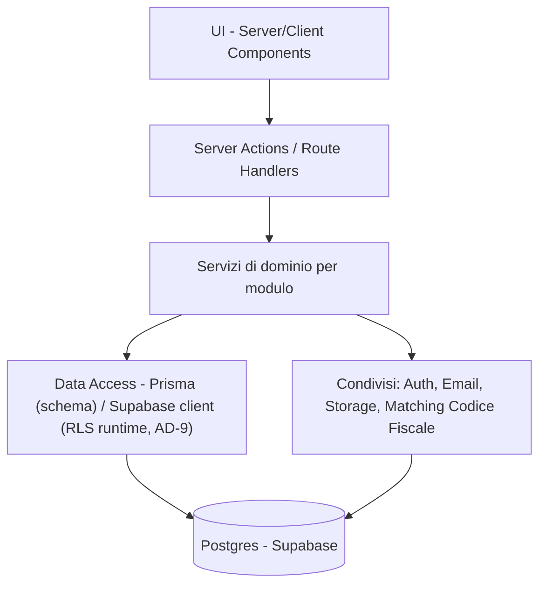
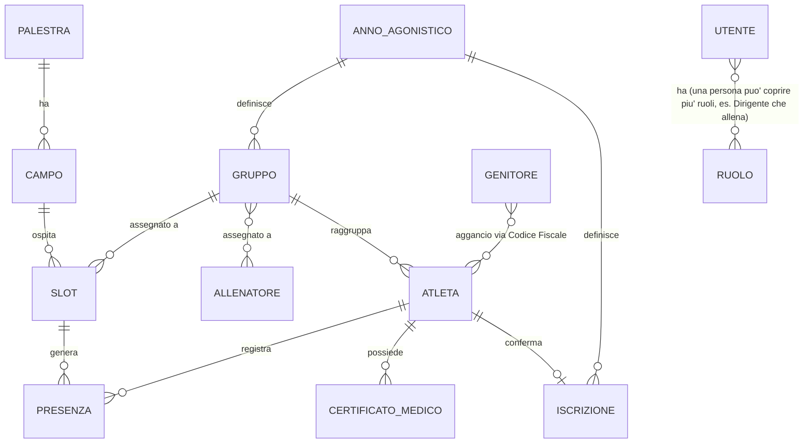

# Architecture Spine — Gestione Settore Volley - Polisportiva

## Design Paradigm

Moduli verticali per feature (Orari-Palestre, Gruppi-Allenatori, Presenze, Certificati-Medici, Iscrizioni, Onboarding-Import, Rollover-Stagionale, Dati-Atleta, Amministrazione), ospitati in un unico monolite Next.js (App Router). Ogni modulo è internamente a strati:

```
UI (Server/Client Components)
  -> Server Action / Route Handler
    -> Servizio di dominio del modulo
      -> Data Access (Prisma)
        -> Postgres (Supabase)
```

Servizi condivisi trasversali (Auth, Email, Storage, Motore Matching Codice Fiscale) vivono fuori dai moduli feature e sono richiamati dal livello Servizio, mai bypassati.

## Invariants & Rules

### AD-1 — Applicazione unica, monolite Next.js
- **Binds:** all
- **Prevents:** deriva tra contratti frontend/backend se fossero deployabili separati
- **Rule:** tutta la logica di business passa da Server Action o Route Handler nello stesso repository Next.js; nessun servizio backend separato.

### AD-2 — Confini dei moduli per feature
- **Binds:** Orari-Palestre, Gruppi-Allenatori, Presenze, Certificati-Medici, Iscrizioni, Onboarding-Import, Rollover-Stagionale, Dati-Atleta, Amministrazione
- **Prevents:** accoppiamento nascosto da letture/scritture dirette di un modulo sui dati di un altro
- **Rule:** ogni modulo possiede le proprie query Prisma e Server Action; l'accesso da un altro modulo passa solo dalle funzioni di servizio esportate o dai servizi condivisi (AD-5), mai da query dirette sulle tabelle di un modulo altrui. In particolare: Orari-Palestre è l'unico proprietario della mutazione di Slot, incluso il suo FK verso Gruppo — Gruppi-Allenatori possiede la creazione del Gruppo e l'assegnazione degli Allenatori, ma non scrive mai direttamente su Slot.

### AD-3 — Prisma come modello dati canonico
- **Binds:** all
- **Prevents:** deriva tra schema applicativo e tabelle Postgres modificate a mano
- **Rule:** ogni cambio di schema passa da una migrazione Prisma; nessuna modifica diretta alle tabelle dalla dashboard Supabase.

### AD-4 — Row-Level Security per i dati sensibili `[ADOPTED]`
- **Binds:** CertificatoMedico, Atleta, Presenza, Iscrizione
- **Prevents:** un controllo solo applicativo che dimentica un percorso ed espone dati sanitari fuori dal proprio ruolo/gruppo/figlio
- **Rule:** policy RLS Postgres, basate sui claim del JWT di Supabase Auth (ruolo + entità collegate: Genitore→proprie Atlete, Allenatore→propri Gruppi), applicano il filtro riga per riga; il codice applicativo non è mai l'unico cancello. Admin, Dirigente e Segreteria hanno policy di accesso ampio (non scoped a una singola Atleta/Gruppo), necessario per operazioni trasversali come l'import massivo (FR-19). Il rifiuto per autorizzazione (RLS o controllo esplicito) restituisce sempre `{ error: { code: 'FORBIDDEN', message } }`, mai `NOT_FOUND` — vedi Consistency Conventions.

### AD-5 — Motore di matching Codice Fiscale come servizio unico `[ADOPTED]`
- **Binds:** Import (FR-19), Onboarding (FR-20, FR-21), Rollover (FR-22, FR-23)
- **Prevents:** tre implementazioni divergenti della stessa logica di riconoscimento/merge
- **Rule:** un solo modulo condiviso espone due operazioni nominate — `trovaPerCodiceFiscale` (lookup) e `unisciCertificato` (merge che implementa la regola "vince la data più recente" di FR-22) — Import, Onboarding e Rollover le richiamano, nessuno reimplementa la logica di merge localmente con semantica propria.

### AD-6 — Storage dei certificati privato con URL firmati
- **Binds:** file di CertificatoMedico
- **Prevents:** esposizione pubblica di documenti sanitari
- **Rule:** il bucket Supabase Storage dei certificati è privato; l'accesso avviene solo tramite URL firmati a scadenza breve, generati lato server dopo verifica dei permessi.

### AD-7 — Promemoria scadenza come singolo punto di ingresso schedulato
- **Binds:** FR-16
- **Prevents:** timer ad-hoc sparsi in più punti del codice
- **Rule:** un solo Cloudflare Cron Trigger invoca un solo Route Handler, che interroga i certificati in scadenza e delega l'invio al servizio email condiviso.

### AD-8 — Anno Agonistico come partizione temporale
- **Binds:** Gruppo, Iscrizione, assegnazione Slot, Presenza
- **Prevents:** logica di "stagione corrente" ambigua e duplicata in ogni modulo
- **Rule:** una sola entità AnnoAgonistico (inizio/fine, 1 agosto – 30 giugno) è referenziata da FK diretta da Gruppo e Iscrizione; Slot e Presenza non hanno un proprio riferimento di stagione — ereditano l'Anno Agonistico transitivamente tramite Gruppo. La "stagione corrente" è risolta da un solo helper condiviso, mai da calcoli di date ripetuti per modulo.

### AD-9 — Split di accesso ai dati: client Supabase per le tabelle protette da RLS, Prisma per lo schema
- **Binds:** CertificatoMedico, Atleta, Presenza, Iscrizione, Notifica, ConfigurazioneSmtp (lette/scritte a runtime via client Supabase autenticato); tutte le tabelle (schema/migrazioni via Prisma)
- **Prevents:** Prisma, connesso direttamente a Postgres, bypassa PostgREST — i claim del JWT (AD-4) non sono automaticamente nella sessione, quindi le policy RLS rischiano di essere valutate senza il contesto utente corretto
- **Rule:** le query a runtime sulle tabelle protette da RLS passano dal client Supabase (`supabase-js`) con la sessione dell'utente autenticato, così PostgREST inoltra i claim e le policy si applicano correttamente; Prisma resta il proprietario dello schema/migrazioni (AD-3) per tutte le tabelle e viene usato a runtime, con connessione privilegiata, solo per le tabelle non protette da RLS (Palestra, Campo, Slot, Gruppo, Allenatore, Utente, UtenteRuolo).

### AD-10 — Atleta: proprietario unico dell'entità
- **Binds:** Atleta
- **Prevents:** più moduli (Certificati-Medici, Iscrizioni, Dati-Atleta, Onboarding-Import) che scrivono in modo scoordinato sulle stesse colonne di Atleta
- **Rule:** Onboarding-Import è l'unico proprietario della creazione/aggiornamento dei campi identitari di Atleta (nome, Codice Fiscale, categoria, ecc.); Certificati-Medici, Iscrizioni e Dati-Atleta creano/aggiornano solo le proprie entità correlate (CertificatoMedico, Iscrizione, dati fisici) via FK verso Atleta, mai colonne di Atleta stessa.

### AD-11 — Ruoli specchiati su Supabase `app_metadata`, Prisma resta fonte di verità
- **Binds:** Utente, UtenteRuolo (relazione molti-a-molti, un Utente può avere più Ruoli)
- **Prevents:** due percorsi di lettura dei ruoli (query Prisma diretta vs JWT) che divergono, o una query Prisma nel middleware su un runtime edge (Cloudflare) dove il supporto a connessioni dirette non è verificato
- **Rule:** i Ruoli vivono in `UtenteRuolo` via Prisma (fonte di verità, AD-3); ogni scrittura dei Ruoli li specchia anche in `app_metadata` dell'utente Supabase Auth, tramite chiamata service-role (mai `user_metadata`, modificabile lato client). Il middleware e ogni route guard leggono i Ruoli solo da `app_metadata` (già nel JWT validato da `getUser()`), mai con una query diretta al database. Se la scrittura su `app_metadata` fallisce dopo che quella su `UtenteRuolo` è riuscita, l'operazione è considerata fallita nel suo complesso (retry, non "successo parziale") — i due scritture sono trattate come un'unica unità logica; la staleness del JWT tra un aggiornamento ruoli e il prossimo refresh del token è accettata (non richiede invalidazione forzata della sessione).

### AD-12 — Configurazione applicativa gestita da Admin, persistita in DB `[ADOPTED, 2026-07-18]`
- **Binds:** Configurazione Email (SMTP), Logo Applicazione
- **Prevents:** credenziali/branding hardcoded in variabili d'ambiente, che richiederebbero un redeploy per essere cambiati e sarebbero visibili a chiunque avesse accesso al repository/ambiente di deploy
- **Rule:** una riga di configurazione (tabella dedicata, RLS **solo ADMIN**, nessun accesso per altri Ruoli) contiene i parametri SMTP; il logo è un file in un bucket Storage **pubblico** (a differenza del bucket privato dei certificati medici, AD-6 — il logo va mostrato pubblicamente nell'UI, non è un dato sensibile). La password SMTP è salvata in chiaro, protetta esclusivamente da RLS ADMIN-only — stesso livello di garanzia già usato per ogni altro dato sensibile di questo progetto (Codice Fiscale, email personali), nessuna cifratura applicativa aggiuntiva: scelta deliberata, coerente col modello di sicurezza esistente e la scala del progetto (non un KMS enterprise per un singolo club). `lib/email/` legge questa configurazione **a runtime** ad ogni invio, mai una variabile d'ambiente — se la configurazione non esiste ancora, l'invio fallisce esplicitamente con un errore chiaro, mai un tentativo silenzioso. *(Origine: correzione di rotta 2026-07-18 — sostituisce la scelta iniziale di Resend con SMTP generico, per riusare una casella email già esistente della polisportiva invece di richiedere un nuovo account/provider terzo.)*



## Consistency Conventions

| Concern | Convention |
| --- | --- |
| Naming (entità, file, interfacce) | Modelli Prisma in italiano, PascalCase singolare (Atleta, Gruppo, CertificatoMedico); route e file kebab-case; Server Action con verbo esplicito (es. `confermaCertificato`) |
| Data & formati | Id come UUID; date persistite in ISO 8601 (l'import normalizza il formato gg/mm/aaaa dell'export federale prima della persistenza); errori dei Server Action come `{ error: { code, message } }`, con `code: 'FORBIDDEN'` riservato esclusivamente ai rifiuti di autorizzazione (mai `NOT_FOUND` per un dato esistente ma non accessibile — vedi AD-4) |
| Stato & trasversali | Tutte le mutazioni passano da Server Action, mai scritture dirette dal client; autenticazione via Supabase Auth con guardia a livello di route group per ruolo, ruoli letti da `app_metadata` nel middleware (AD-11); configurazione via variabili d'ambiente (Cloudflare Pages project settings), **eccetto** i parametri SMTP e il logo, gestiti dall'Admin a runtime via DB/Storage (AD-12, 2026-07-18) proprio per non richiedere un redeploy |

## Stack

| Name | Version |
| --- | --- |
| Next.js (App Router) | 16.x |
| React | 19.2.x (incluso in Next 16) |
| TypeScript | 6.x (7.0 appena rilasciato luglio 2026, riscrittura nativa Go: non ancora pinnato per prudenza sull'ecosistema Next.js/React; upgrade previsto quando maturo) |
| Supabase (Postgres, Auth, Storage) | piano Free — attenzione: auto-pausa dopo 7 giorni di inattività (vedi Deferred) |
| Prisma | 7.x — richiede driver adapter esplicito (`@prisma/adapter-pg`) e `prisma.config.ts`, cambio rispetto alle guide Prisma 6 |
| Nodemailer (SMTP generico) | 9.x — sostituisce Resend (AD-12, 2026-07-18): riusa una casella email SMTP esistente della polisportiva invece di un nuovo account/provider terzo, parametri configurabili a runtime dall'Admin |
| Cloudflare Pages/Workers (hosting + Cron Trigger) | piano Free — deploy Next.js 16 via adapter `@opennextjs/cloudflare` (percorso ufficialmente supportato); Cron Trigger incluso nel piano gratuito; a differenza di Vercel Hobby, il piano Free permette esplicitamente uso commerciale/organizzativo |

## Structural Seed



```text
app/
  (auth)/                    # solo login/sessione/logout - meccanica di autenticazione, non registrazione di dominio
  (orari-palestre)/          # FR-1..FR-5
  (gruppi-allenatori)/       # FR-6, FR-7
  (presenze)/                # FR-8..FR-10
  (certificati-medici)/      # FR-11..FR-16
  (iscrizioni)/               # FR-17
  (onboarding-import)/        # FR-18..FR-21 - registrazione per ruolo, import, aggancio genitore-atleta, precaricamento allenatori (AD-10: proprietario di Atleta)
  (rollover-stagionale)/       # FR-22, FR-23
  (dati-atleta)/               # FR-24, FR-25
  (amministrazione)/           # FR-26, FR-27, FR-29 (Vista Dirigente)
  (configurazione)/            # FR-31, FR-32 - parametri SMTP e logo, solo Admin (AD-12)
  api/cron/promemoria-certificati/   # AD-7 (raddoppia da keep-alive per Supabase, vedi Deferred)
lib/
  auth/                      # wrapper Supabase Auth (client utente), guardie per ruolo che leggono app_metadata (AD-11)
  auth-admin/                # client Supabase service-role, scrive app_metadata dopo ogni scrittura Ruoli (AD-11) - mai esposto al client
  email/                     # wrapper Nodemailer (SMTP), legge configurazione da DB a runtime (AD-12)
  storage/                   # wrapper Supabase Storage, URL firmati (AD-6)
  matching-codice-fiscale/   # motore condiviso: trovaPerCodiceFiscale, unisciCertificato (AD-5)
  anno-agonistico/           # helper stagione corrente, risoluzione transitiva Slot/Presenza (AD-8)
  db-rls/                    # client Supabase per tabelle protette da RLS (AD-9)
prisma/
  schema.prisma              # modello dati canonico (AD-3), usato per schema/migrazioni e per le tabelle non protette da RLS
```

## Capability → Architecture Map

| Capability / Area | Lives in | Governed by |
| --- | --- | --- |
| Orari, Palestre, Campi, Slot (FR-1..FR-5) | `app/(orari-palestre)/` | AD-2, AD-8 |
| Gruppi e Allenatori (FR-6, FR-7) | `app/(gruppi-allenatori)/` | AD-2, AD-8 |
| Presenze (FR-8..FR-10) | `app/(presenze)/`, `lib/db-rls/` | AD-2, AD-4, AD-9 |
| Certificati Medici (FR-11..FR-16) | `app/(certificati-medici)/`, `lib/storage/`, `lib/email/`, `lib/db-rls/` | AD-2, AD-4, AD-6, AD-7, AD-9, AD-10, AD-12 |
| Iscrizioni (FR-17) | `app/(iscrizioni)/`, `lib/db-rls/` | AD-2, AD-4, AD-9 |
| Onboarding e Import (FR-18..FR-21) | `app/(onboarding-import)/`, `lib/matching-codice-fiscale/`, `lib/db-rls/` | AD-2, AD-4, AD-5, AD-9, AD-10 |
| Configurazione Applicazione (FR-31, FR-32) | `app/(configurazione)/`, `lib/email/`, `lib/db-rls/` (FR-31, SMTP: tabella `configurazione_smtp`), `lib/storage/` (FR-32, logo: bucket pubblico, nessuna tabella DB) | AD-2, AD-9, AD-12 |
| Rollover Stagionale (FR-22, FR-23) | `app/(rollover-stagionale)/`, `lib/matching-codice-fiscale/` | AD-2, AD-5, AD-8, AD-10 |
| Dati Atleta (FR-24, FR-25) | `app/(dati-atleta)/` | AD-2 |
| Amministrazione e Vista Dirigente (FR-26, FR-27, FR-29) | `app/(amministrazione)/` | AD-2, AD-4 |

## Deferred

- **Meccanismo di autenticazione dettagliato oltre email+password** (PRD §9) — Supabase Auth base è sufficiente per il v1; alternative (magic link, SSO) rimandate.
- **Log di accesso/audit sui dati sanitari** (PRD §9) — non richiesto per il v1; se necessario in futuro, si aggiunge come estensione di AD-4 senza cambiare il modello dati core.
- **Residenza dei dati sanitari** (PRD §9, Certificati Medici di minorenni) — il progetto Supabase va creato in regione EU (es. Frankfurt) per mantenere il dato in ambito europeo; scelta di buon senso vincolata qui come nota operativa, non richiede un AD dedicato dato che non genera un punto di divergenza tra moduli.
- **FR-5, FR-10, FR-24, FR-25** (Should/Could, fuori dal perimetro v1 per PRD §6.2) — nessuna decisione architetturale aggiuntiva necessaria: si inseriscono nei moduli esistenti (rispettivamente Orari-Palestre, Presenze, Dati-Atleta) senza cambiare i confini o le regole già fissate.
- **Permessi granulari fine oltre il ruolo base** (FR-27, Should) — il v1 usa RLS a livello di ruolo/entità collegata (AD-4); una granularità più fine (es. permessi per singolo campo dato) è un'estensione futura delle policy, non un cambio di paradigma.
- **Wizard Nuova Stagione (FR-28, Could)** — dettaglio di cosa viene copiato/adattato dall'anno precedente non ancora deciso; quando affrontato, si appoggia al modulo Rollover-Stagionale esistente (AD-2).
- **Estensione pluri-settore (~1500 atlete, PRD §8 Scala)** — solo un'indicazione di ordine di grandezza per ora; il modello dati non introduce oggi un concetto di "Settore" sportivo distinto dal Volley — se e quando l'estensione sarà reale, richiederà una revisione di AD-2 (i moduli oggi sono impliciti al volley) e dello schema (Gruppo, Slot, ecc. dovrebbero riferirsi a un Settore).
- **Ambiente di deploy** — un solo progetto Supabase e un solo progetto Cloudflare Pages (produzione); Cloudflare genera automaticamente deploy di anteprima per branch/PR, usati come ambiente di test informale — non è previsto un ambiente di staging dedicato dato il contesto solo-dev.
- **Auto-pausa Supabase Free tier** (dopo 7 giorni di inattività) — rischio concreto data la struttura per Anno Agonistico (bassa attività in estate). Mitigazione: il Cron Trigger giornaliero già previsto da AD-7 (promemoria certificati) esegue comunque una query ogni giorno, il che mantiene il progetto attivo — nessun cron aggiuntivo necessario, ma va verificato che l'esecuzione tocchi effettivamente il database anche quando non ci sono certificati in scadenza.
